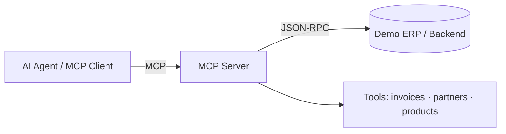

# MCP Server — ERP / JSON-RPC Bridge

> A [Model Context Protocol](https://modelcontextprotocol.io) server that exposes a backend (a demo ERP or any JSON-RPC API) to AI agents as structured tools — read invoices, partners and products via clean, typed MCP tools.


> 🧪 **This is a clean-room, generic implementation.** It ships with a **demo dataset** and connects to a sample/self-hosted backend. It contains **no proprietary code, client data, or business logic** from any employer.

## Why

LLM agents are great at reasoning but blind to your business data. MCP is the emerging standard for giving them safe, structured access. This server turns ERP-style records into **MCP tools** an agent can call, without hand-rolling integrations per agent.

## Features

- 🛠️ **MCP tools** for common entities: `list_invoices`, `get_partner`, `search_products` — a small, generic ERP schema (`Partner`, `Product`, `Invoice` with line items). Demo and live modes return identical shapes.
- 🔄 **JSON-RPC backend adapter** — point it at a demo ERP or any JSON-RPC 2.0 endpoint.
- 🔒 **Read-only by default** — two enforcement layers: an MCP tool allowlist and a per-method JSON-RPC allowlist checked before every call.
- 🧪 **Demo mode** — bundled sample data so anyone can run it offline, with no backend.

## Architecture



The package is layered:

| Module | Responsibility |
|--------|----------------|
| `mcp_server/server.py` | Assembles a `FastMCP` server and registers the three tools. |
| `mcp_server/backends/` | `Backend` protocol + `DemoBackend` (offline) and `JsonRpcBackend` (live). |
| `mcp_server/models.py` | Typed, generic ERP entities (`Partner`, `Product`, `Invoice`). |
| `mcp_server/security.py` | Read-only allowlist enforcement. |
| `mcp_server/config.py` | Settings from defaults < `.env` < env vars < CLI flags. |

## Tools

| Tool | Arguments | Returns |
|------|-----------|---------|
| `list_invoices` | `partner_id?`, `state?` (`draft`/`posted`/`paid`), `limit?` (1–200) | `{ count, invoices[] }` |
| `get_partner` | `partner_id` | a single `Partner` |
| `search_products` | `query?` (name/SKU substring), `category?`, `limit?` (1–200) | `{ count, products[] }` |

## Getting started

```bash
git clone https://github.com/AntoniRomera/mcp-erp-server.git
cd mcp-erp-server
pip install -r requirements.txt   # or: pip install -e ".[dev]"
cp .env.example .env              # backend URL + creds for YOUR demo instance
python -m mcp_server --demo       # runs against bundled sample data, offline
```

### CLI

```bash
python -m mcp_server --demo                 # bundled sample data, offline
python -m mcp_server                         # live JSON-RPC backend (BACKEND_URL)
python -m mcp_server --backend-url URL       # override the endpoint
python -m mcp_server --allow-write           # disable the read-only allowlist
python -m mcp_server --version
```

The server speaks MCP over **stdio** (the default transport), ready to be registered with any MCP client.

### Register it with an MCP client

For **Claude Desktop**, add the following to your config file
(macOS: `~/Library/Application Support/Claude/claude_desktop_config.json`,
Windows: `%APPDATA%\Claude\claude_desktop_config.json`), then restart the app:

```json
{
  "mcpServers": {
    "erp-demo": {
      "command": "python",
      "args": ["-m", "mcp_server", "--demo"],
      "cwd": "/absolute/path/to/mcp-erp-server"
    }
  }
}
```

A copy-paste version (with a commented live-backend variant) ships at
[`examples/claude_desktop_config.json`](examples/claude_desktop_config.json).
For **other / generic stdio clients**, see
[`examples/generic_mcp_client.md`](examples/generic_mcp_client.md).

## Configuration

All settings are read by `mcp_server.config.Settings` (pydantic-settings) from
environment variables or a `.env` file. Precedence is
**defaults < `.env` < environment variables < CLI flags**. See
[`.env.example`](.env.example) for a template.

| Variable | Description | Default |
|----------|-------------|---------|
| `BACKEND_URL` | JSON-RPC endpoint used in live mode | `http://localhost:8069` |
| `READONLY` | Restrict to the read-only allowlist | `true` |
| `DEMO` | Serve the bundled sample dataset offline | `false` |
| `REQUEST_TIMEOUT` | JSON-RPC HTTP timeout (seconds) | `30` |
| `BACKEND_API_KEY` | Optional bearer token / `api_key` param | _(unset)_ |
| `BACKEND_USERNAME` | Optional username param | _(unset)_ |
| `BACKEND_PASSWORD` | Optional password param | _(unset)_ |
| `BACKEND_DATABASE` | Optional database / tenant param | _(unset)_ |

> ⚠️ Never commit a real `.env`. It is git-ignored; only `.env.example` (with placeholders) belongs in the repo.

## Security model

The server is read-only by default and enforces it in two places:

1. **Tool allowlist** — only `list_invoices`, `get_partner` and `search_products` are registered.
2. **Method allowlist** — `enforce_readonly` rejects any JSON-RPC method outside `{invoices.list, partners.get, products.search}` before the request is sent, so even a misconfigured tool cannot trigger a mutating call while `READONLY` is enabled.

Write access is an explicit opt-in via `--allow-write` (reserved for future write tools).

## Development

```bash
pip install -e ".[dev]"
ruff check .        # lint
pytest -q           # run the test suite
```

The test suite (`tests/`) covers the domain models, settings/CLI precedence, the
read-only allowlist, the offline demo backend, the JSON-RPC adapter (HTTP mocked
with `respx`), and the assembled MCP tools end-to-end against a fake backend.

## Continuous integration

[`.github/workflows/ci.yml`](.github/workflows/ci.yml) runs `ruff` and `pytest`
on Python 3.11 and 3.12 for every push and pull request to `main`, plus a smoke
test that boots the demo server and verifies the expected tools are exposed.

## Roadmap

- [ ] Optional write tools (`create_invoice`, `update_partner`) behind the existing `--allow-write` flag and a per-tool allowlist (read-only by default in v0.1).
- [ ] Auth / scoping per tool
- [ ] Demo recording

## License

[MIT](LICENSE) © 2026 Antoni Romera Luis

---
> ⚠️ Keep this generic. Never commit real client data, credentials, or employer modules.
